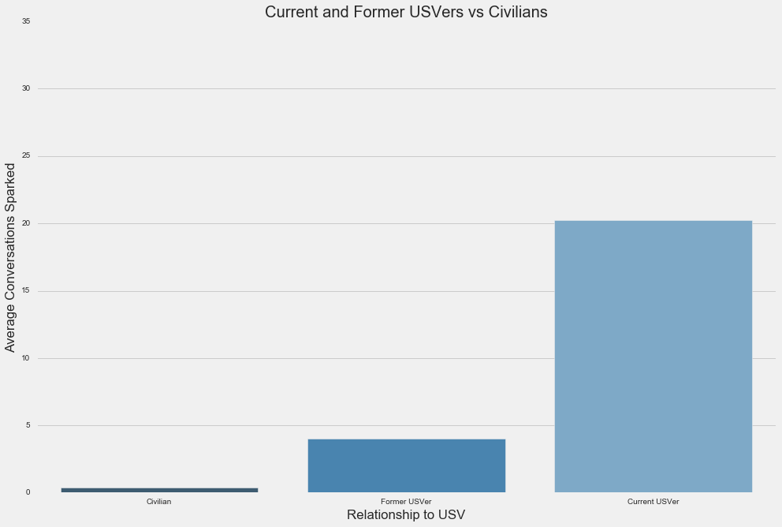
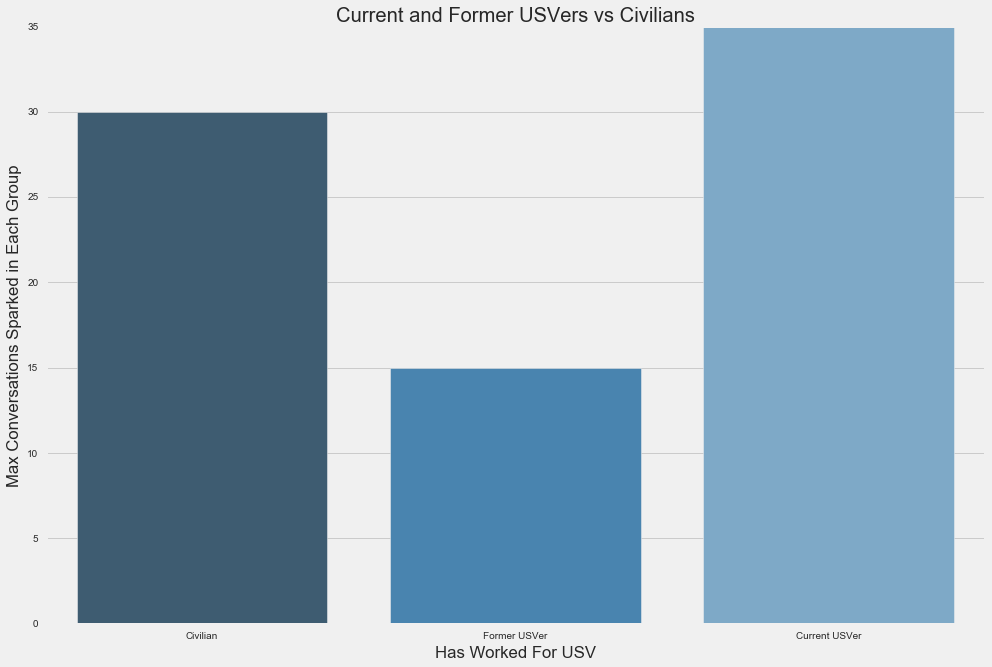
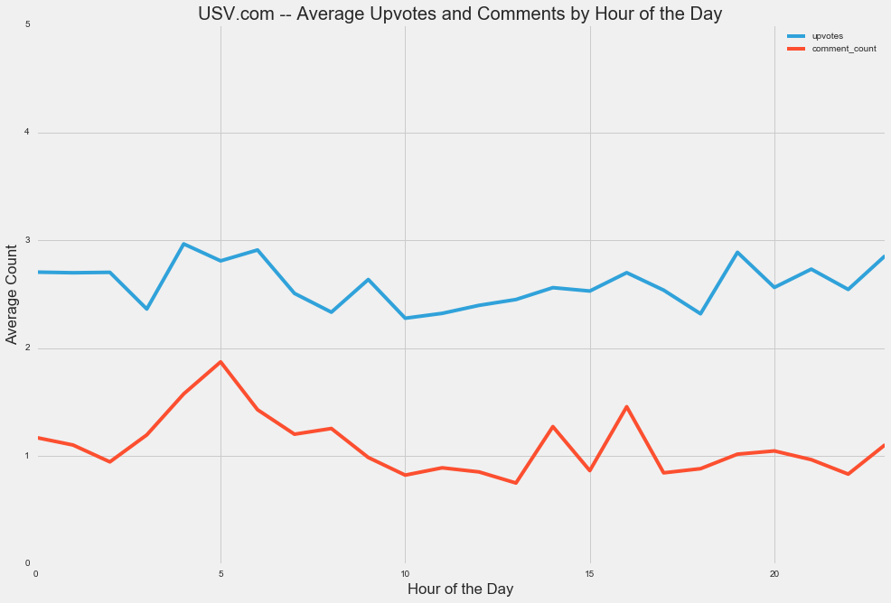
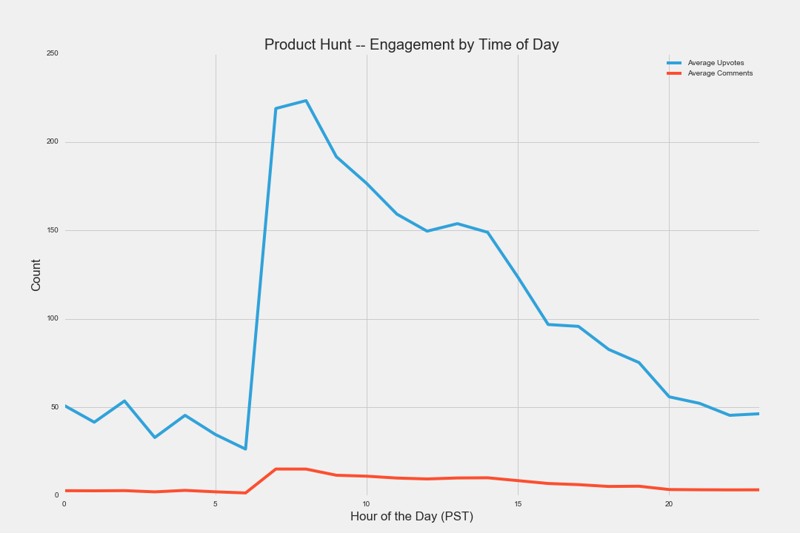
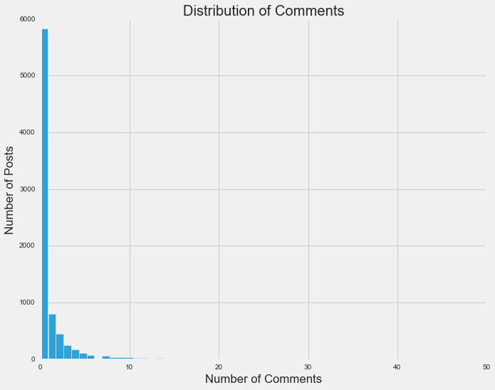

```
import pandas as pd
import numpy as np
import matplotlib.pyplot as plt
import seaborn as sns
import gensim

from sklearn.feature_extraction.text import CountVectorizer, TfidfVectorizer
from sklearn.feature_extraction.text import TfidfTransformer
from sklearn.linear_model import LogisticRegression
from sklearn import decomposition

from IPython.display import Image
from IPython.display import HTML

%matplotlib inline

from pylab import rcParams

rcParams['figure.figsize'] = 15, 10
 
plt.style.use('fivethirtyeight')
```


```
HTML('''<script>
code_show=true; 
function code_toggle() {
 if (code_show){
 $('div.input').hide();
 } else {
 $('div.input').show();
 }
 code_show = !code_show
} 
$( document ).ready(code_toggle);
</script>
<form action="javascript:code_toggle()"><input type="submit" value="Click here to hide / unhide the raw python code."></form>''')
```


<script>
code_show=true; 
function code_toggle() {
 if (code_show){
 $('div.input').hide();
 } else {
 $('div.input').show();
 }
 code_show = !code_show
} 
$( document ).ready(code_toggle);
</script>
<form action="javascript:code_toggle()"><input type="submit" value="Click here to hide / unhide the raw python code."></form>


```
def output_columns(df,rounding=2):
    #keep as a dataframe to perform vectorized string operations
    names = pd.DataFrame(df.columns)
    names.columns= ['temp']
    names = pd.DataFrame(names.temp.str.replace("_", " "))
    df.columns = list(names.temp.str.title().str.replace('usv','USV',case=False))
    return df
```


```
posts = pd.read_csv('usv_posts_cleaned.csv',encoding='utf8',parse_dates=True)
posters = pd.read_csv("usv_posters_cleaned.csv",encoding="utf8")

```


```
posts.date_created = pd.to_datetime(posts.date_created)
posters['relation_to_USV'] =  np.where((posters.ever_usver)&(posters.is_usver==False),'Former USVer','Civilian')
posters.ix[posters.is_usver,'relation_to_USV'] = "Current USVer"
```

# What is this?

This is a brief analysis of [USV.com](https://www.USV.com) post data from inception to Feb 2015. I explore top posters, look for patterns, favorite topics and and even some profiles on what different community members like to discuss. 

The data includes: 
+ the poster's twitter handle
+ the post title
+ the user submitted description (body text)
+ the time of the post
+ who upvoted it 
+ comments and upvotes recieved 

This is all publicly scrapable, but was given to me during a hack day. 

Below is an example of the data set, sorted by comment count:


```
output_columns(posts.sort_values('comment_count',ascending=False)).head()
```


<div>
<table border="1" class="dataframe">
  <thead>
    <tr style="text-align: right;">
      <th></th>
      <th>Title</th>
      <th>Poster</th>
      <th>Date Created</th>
      <th>Upvotes</th>
      <th>Comment Count</th>
      <th>Voted Users</th>
      <th>Body Text</th>
    </tr>
  </thead>
  <tbody>
    <tr>
      <th>1193</th>
      <td>Bitcoin As Protocol</td>
      <td>albertwenger</td>
      <td>2013-10-31 16:00:51.061</td>
      <td>42</td>
      <td>216</td>
      <td>[u'albertwenger', u'aweissman', u'ppearlman', ...</td>
      <td>We owe many of the innovations that we use eve...</td>
    </tr>
    <tr>
      <th>2540</th>
      <td>Winning on Trust</td>
      <td>nickgrossman</td>
      <td>2013-12-24 07:15:10.488</td>
      <td>21</td>
      <td>88</td>
      <td>[u'nickgrossman', u'aweissman', u'albertwenger...</td>
      <td>Thoughts on why trust will be central to #winn...</td>
    </tr>
    <tr>
      <th>1807</th>
      <td>Vote vs. Like vs. Favorite vs. INSERT VERB HERE</td>
      <td>falicon</td>
      <td>2013-11-22 14:28:30.619</td>
      <td>12</td>
      <td>67</td>
      <td>[u'falicon', u'nickgrossman', u'kidmercury', u...</td>
      <td>Throwing the question about what to call the u...</td>
    </tr>
    <tr>
      <th>3045</th>
      <td>Feedback wanted: new look front page at usv.com</td>
      <td>nickgrossman</td>
      <td>2014-01-21 08:59:51.998</td>
      <td>11</td>
      <td>67</td>
      <td>[u'nickgrossman', u'ron_miller', u'julien51', ...</td>
      <td>Hi Everyone --\nLast week we started experimen...</td>
    </tr>
    <tr>
      <th>4178</th>
      <td>To Dare is To Do</td>
      <td>billmcneely</td>
      <td>2014-03-17 06:08:44.918</td>
      <td>33</td>
      <td>62</td>
      <td>[u'billmcneely', u'annelibby', u'LonnyLot', u'...</td>
      <td>Yesterday I was watching a proper football mat...</td>
    </tr>
  </tbody>
</table>
</div>


## Top Posters

Here are the stats for the top 10 posters determined by the number of conversation their posts sparked:


```
poster_metrics = ['poster','post_count','mean_comments','conversations_sparked',
                  "percent_of_posts_with_comments",'relation_to_USV']
output_columns(posters.sort_values('conversations_sparked',ascending=False)[poster_metrics].head(10).round(2))
```


<div>
<table border="1" class="dataframe">
  <thead>
    <tr style="text-align: right;">
      <th></th>
      <th>Poster</th>
      <th>Post Count</th>
      <th>Mean Comments</th>
      <th>Conversations Sparked</th>
      <th>Percent Of Posts With Comments</th>
      <th>Relation To USV</th>
    </tr>
  </thead>
  <tbody>
    <tr>
      <th>257</th>
      <td>aweissman</td>
      <td>452</td>
      <td>1.52</td>
      <td>45</td>
      <td>0.43</td>
      <td>Current USVer</td>
    </tr>
    <tr>
      <th>381</th>
      <td>fredwilson</td>
      <td>542</td>
      <td>1.46</td>
      <td>43</td>
      <td>0.39</td>
      <td>Current USVer</td>
    </tr>
    <tr>
      <th>543</th>
      <td>nickgrossman</td>
      <td>295</td>
      <td>2.19</td>
      <td>37</td>
      <td>0.43</td>
      <td>Current USVer</td>
    </tr>
    <tr>
      <th>700</th>
      <td>wmougayar</td>
      <td>394</td>
      <td>1.09</td>
      <td>30</td>
      <td>0.31</td>
      <td>Civilian</td>
    </tr>
    <tr>
      <th>235</th>
      <td>albertwenger</td>
      <td>143</td>
      <td>2.97</td>
      <td>19</td>
      <td>0.39</td>
      <td>Current USVer</td>
    </tr>
    <tr>
      <th>475</th>
      <td>kidmercury</td>
      <td>277</td>
      <td>0.94</td>
      <td>17</td>
      <td>0.29</td>
      <td>Civilian</td>
    </tr>
    <tr>
      <th>567</th>
      <td>pointsnfigures</td>
      <td>574</td>
      <td>0.47</td>
      <td>16</td>
      <td>0.17</td>
      <td>Civilian</td>
    </tr>
    <tr>
      <th>282</th>
      <td>bwats</td>
      <td>99</td>
      <td>1.90</td>
      <td>15</td>
      <td>0.36</td>
      <td>Former USVer</td>
    </tr>
    <tr>
      <th>367</th>
      <td>falicon</td>
      <td>58</td>
      <td>4.26</td>
      <td>12</td>
      <td>0.52</td>
      <td>Civilian</td>
    </tr>
    <tr>
      <th>450</th>
      <td>jmonegro</td>
      <td>178</td>
      <td>0.87</td>
      <td>11</td>
      <td>0.32</td>
      <td>Current USVer</td>
    </tr>
  </tbody>
</table>
</div>


All of the data on posters is calculated from the posts's above. I also manually added whether or not the post works at USV or worked at USV as of Feb 2015, which is when I did this. The only difference is that Brittany worked at USV in Feb 2015 and now works at May 2016.


```
# Highest ranked non-USVer posters
output_columns(posters.loc[(posters.ever_usver==False)& 
                           (posters.conversations_sparked>1)].sort_values('conversations_sparked')).to_csv('Top Posters.csv',index=False)
```

## Current and Former USVers

Here are the stats for all current USVers and alumni:


```
output_columns(posters.ix[posters.ever_usver,poster_metrics].sort_values(['relation_to_USV','post_count']))
```


<div>
<table border="1" class="dataframe">
  <thead>
    <tr style="text-align: right;">
      <th></th>
      <th>Poster</th>
      <th>Post Count</th>
      <th>Mean Comments</th>
      <th>Conversations Sparked</th>
      <th>Percent Of Posts With Comments</th>
      <th>Relation To USV</th>
    </tr>
  </thead>
  <tbody>
    <tr>
      <th>455</th>
      <td>johnbuttrick</td>
      <td>33</td>
      <td>1.42</td>
      <td>2</td>
      <td>0.42</td>
      <td>Current USVer</td>
    </tr>
    <tr>
      <th>278</th>
      <td>br_ttany</td>
      <td>79</td>
      <td>0.91</td>
      <td>6</td>
      <td>0.27</td>
      <td>Current USVer</td>
    </tr>
    <tr>
      <th>490</th>
      <td>libovness</td>
      <td>89</td>
      <td>1.58</td>
      <td>9</td>
      <td>0.36</td>
      <td>Current USVer</td>
    </tr>
    <tr>
      <th>33</th>
      <td>BradUSV</td>
      <td>94</td>
      <td>1.24</td>
      <td>10</td>
      <td>0.15</td>
      <td>Current USVer</td>
    </tr>
    <tr>
      <th>235</th>
      <td>albertwenger</td>
      <td>143</td>
      <td>2.97</td>
      <td>19</td>
      <td>0.39</td>
      <td>Current USVer</td>
    </tr>
    <tr>
      <th>450</th>
      <td>jmonegro</td>
      <td>178</td>
      <td>0.87</td>
      <td>11</td>
      <td>0.32</td>
      <td>Current USVer</td>
    </tr>
    <tr>
      <th>543</th>
      <td>nickgrossman</td>
      <td>295</td>
      <td>2.19</td>
      <td>37</td>
      <td>0.43</td>
      <td>Current USVer</td>
    </tr>
    <tr>
      <th>257</th>
      <td>aweissman</td>
      <td>452</td>
      <td>1.52</td>
      <td>45</td>
      <td>0.43</td>
      <td>Current USVer</td>
    </tr>
    <tr>
      <th>381</th>
      <td>fredwilson</td>
      <td>542</td>
      <td>1.46</td>
      <td>43</td>
      <td>0.39</td>
      <td>Current USVer</td>
    </tr>
    <tr>
      <th>67</th>
      <td>EricFriedman</td>
      <td>5</td>
      <td>0.00</td>
      <td>0</td>
      <td>0.00</td>
      <td>Former USVer</td>
    </tr>
    <tr>
      <th>292</th>
      <td>ceonyc</td>
      <td>5</td>
      <td>0.00</td>
      <td>0</td>
      <td>0.00</td>
      <td>Former USVer</td>
    </tr>
    <tr>
      <th>296</th>
      <td>christinacaci</td>
      <td>17</td>
      <td>2.53</td>
      <td>3</td>
      <td>0.47</td>
      <td>Former USVer</td>
    </tr>
    <tr>
      <th>385</th>
      <td>garychou</td>
      <td>18</td>
      <td>4.00</td>
      <td>3</td>
      <td>0.50</td>
      <td>Former USVer</td>
    </tr>
    <tr>
      <th>11</th>
      <td>AlexanderPease</td>
      <td>49</td>
      <td>1.53</td>
      <td>3</td>
      <td>0.39</td>
      <td>Former USVer</td>
    </tr>
    <tr>
      <th>282</th>
      <td>bwats</td>
      <td>99</td>
      <td>1.90</td>
      <td>15</td>
      <td>0.36</td>
      <td>Former USVer</td>
    </tr>
  </tbody>
</table>
</div>


```
# Create a csv of all USVers
output_columns(posters.loc[posters.ever_usver==True].sort_values('conversations_sparked',ascending=False)).to_csv("USVers by the Numbers.csv",index=False)
```

## Infrequent, but High Value Posters

This is a segment of posters that post infrequently, but have high per post engagment. This is a group that the community wants to hear more from. The cutoffs are:
+ Averages more than 2 comments per post
+ Posted between 5 and 15 times

These cutoffs, like all cutoffs, are somewhat arbitrary. They felt directionally correct to me.


```
output_columns(posters.ix[(posters.mean_comments>2)&
           (posters.post_count>=5)&
           (posters.post_count<=15),poster_metrics].sort_values('mean_comments'))

# Uncoment and move up to output as a CSV
# .to_csv('Occasional, but Valuable Posters.csv',index=False)
```


<div>
<table border="1" class="dataframe">
  <thead>
    <tr style="text-align: right;">
      <th></th>
      <th>Poster</th>
      <th>Post Count</th>
      <th>Mean Comments</th>
      <th>Conversations Sparked</th>
      <th>Percent Of Posts With Comments</th>
      <th>Relation To USV</th>
    </tr>
  </thead>
  <tbody>
    <tr>
      <th>27</th>
      <td>BenedictEvans</td>
      <td>13</td>
      <td>2.08</td>
      <td>2</td>
      <td>0.38</td>
      <td>Civilian</td>
    </tr>
    <tr>
      <th>349</th>
      <td>ebellity</td>
      <td>10</td>
      <td>2.20</td>
      <td>2</td>
      <td>0.60</td>
      <td>Civilian</td>
    </tr>
    <tr>
      <th>293</th>
      <td>cezinho</td>
      <td>6</td>
      <td>2.33</td>
      <td>1</td>
      <td>0.50</td>
      <td>Civilian</td>
    </tr>
    <tr>
      <th>594</th>
      <td>rrhoover</td>
      <td>14</td>
      <td>2.43</td>
      <td>3</td>
      <td>0.64</td>
      <td>Civilian</td>
    </tr>
    <tr>
      <th>283</th>
      <td>bwertz</td>
      <td>9</td>
      <td>2.67</td>
      <td>3</td>
      <td>0.67</td>
      <td>Civilian</td>
    </tr>
    <tr>
      <th>559</th>
      <td>patrickjmorris</td>
      <td>11</td>
      <td>2.73</td>
      <td>2</td>
      <td>0.45</td>
      <td>Civilian</td>
    </tr>
    <tr>
      <th>229</th>
      <td>adsy_me</td>
      <td>12</td>
      <td>2.75</td>
      <td>1</td>
      <td>0.42</td>
      <td>Civilian</td>
    </tr>
    <tr>
      <th>496</th>
      <td>manuelmolina</td>
      <td>6</td>
      <td>2.83</td>
      <td>1</td>
      <td>0.83</td>
      <td>Civilian</td>
    </tr>
    <tr>
      <th>673</th>
      <td>tomcritchlow</td>
      <td>12</td>
      <td>2.92</td>
      <td>3</td>
      <td>0.58</td>
      <td>Civilian</td>
    </tr>
    <tr>
      <th>456</th>
      <td>johnfazzolari</td>
      <td>5</td>
      <td>3.00</td>
      <td>1</td>
      <td>0.40</td>
      <td>Civilian</td>
    </tr>
    <tr>
      <th>77</th>
      <td>GeoffreyWeg</td>
      <td>10</td>
      <td>3.30</td>
      <td>3</td>
      <td>0.50</td>
      <td>Civilian</td>
    </tr>
    <tr>
      <th>323</th>
      <td>davewiner</td>
      <td>7</td>
      <td>3.57</td>
      <td>2</td>
      <td>0.71</td>
      <td>Civilian</td>
    </tr>
    <tr>
      <th>522</th>
      <td>moot</td>
      <td>10</td>
      <td>3.70</td>
      <td>4</td>
      <td>0.80</td>
      <td>Civilian</td>
    </tr>
    <tr>
      <th>568</th>
      <td>ppearlman</td>
      <td>11</td>
      <td>3.73</td>
      <td>2</td>
      <td>0.27</td>
      <td>Civilian</td>
    </tr>
    <tr>
      <th>599</th>
      <td>ryaneshea</td>
      <td>5</td>
      <td>4.80</td>
      <td>2</td>
      <td>0.80</td>
      <td>Civilian</td>
    </tr>
    <tr>
      <th>696</th>
      <td>whitneymcn</td>
      <td>5</td>
      <td>5.00</td>
      <td>2</td>
      <td>0.40</td>
      <td>Civilian</td>
    </tr>
    <tr>
      <th>135</th>
      <td>MsPseudolus</td>
      <td>15</td>
      <td>6.33</td>
      <td>4</td>
      <td>0.60</td>
      <td>Civilian</td>
    </tr>
    <tr>
      <th>460</th>
      <td>jordancooper</td>
      <td>7</td>
      <td>6.57</td>
      <td>2</td>
      <td>0.57</td>
      <td>Civilian</td>
    </tr>
  </tbody>
</table>
</div>


```
posts = posts.merge(posters[['poster','is_usver','ever_usver']],on='poster',how='left')
```

## USVers vs Civilians


This the average number of conversations sparked by posters based on their relationship to USV:


```
sns.barplot('relation_to_USV','conversations_sparked',data=posters, palette="Blues_d",estimator=np.mean,ci=None)
sns.plt.title("Current and Former USVers vs Civilians")
sns.axlabel("Relationship to USV","Average Conversations Sparked")
plt.ylim(0,35)
sns.plt.savefig("USVers vs Non-USVers (Top Posts).png", dpi=100)
```





Current USVers tend to spark more conversations. Could that be because the civilian category is weighed down by inactive accounts? 

Here is amount of current USVers, former USVers and Civilains who have posted.


```
posters.groupby('relation_to_USV').count()[['poster']].rename(columns={'poster':'Number of Unique Posters'})
```


<div>
<table border="1" class="dataframe">
  <thead>
    <tr style="text-align: right;">
      <th></th>
      <th>Number of Unique Posters</th>
    </tr>
    <tr>
      <th>relation_to_USV</th>
      <th></th>
    </tr>
  </thead>
  <tbody>
    <tr>
      <th>Civilian</th>
      <td>699</td>
    </tr>
    <tr>
      <th>Current USVer</th>
      <td>9</td>
    </tr>
    <tr>
      <th>Former USVer</th>
      <td>6</td>
    </tr>
  </tbody>
</table>
</div>


There are a lot more Civialians. Perhaps, it's not surpising their average was low. Below is the same plot, except it gets the maxium conversations sparked, instead of the average.


```
sns.barplot('relation_to_USV','conversations_sparked',data=posters, palette="Blues_d",estimator=np.max,ci=None)
sns.plt.title("Current and Former USVers vs Civilians")
sns.axlabel("Has Worked For USV","Max Conversations Sparked in Each Group")
plt.ylim(0,35)
sns.plt.savefig("USVers vs Non-USVers (Top Posts).png", dpi=100)
```





As you can see, some Civilians (or at least one) have sparked a comparable number of discussions to the USVers. 

## Post Enagagement by Time Posted


Does it matter what time of day a post is made?


```
posts.groupby(posts.date_created.dt.hour).mean()[['upvotes','comment_count']].plot(legend=True)
plt.ylim(0,5)
plt.title('USV.com -- Average Upvotes and Comments by Hour of the Day')
plt.xlabel('Hour of the Day')
plt.ylabel('Average Count')
```


    <matplotlib.text.Text at 0x11627f7d0>





There is not a strong pattern between when something is posted and the number of upvotes and comments it recieves. 


This is what the same graph looks like for Product Hunt (data pulled from their API): 


```
Image(filename='Counts and Upvotes by Hour - Product Hunt.png') 
```





Product Hunt has s strong pattern based on time of day. This is because Product Hunt resets every day. USV.com does not.

This could indicate an opportunity. If USV.com built in a predictable time cycle, it could lead to habitual visits, posts and discussions. Reddit and Hacker News show you don't need a daily leaderboard that restart at midnight. However, people should expect to see new content at some time interval. AVC does this very well.


```

##
# posts.set_index('date_created')['comment_count'].resample('M').count()[:-1].plot()
# That is the evolution of montly posts over time. USV.com was primarly a blog for occasional 
# posts from 2006 - 2013. You can see when USV.com allowed anyone to submit links. By number of 
# posts, this peaked in 2013. However, I think number of posts is the wrong metric.
```

# What Does The Community Like To Discuss?

Before answering that, we must define "like to discuss". One way to define it is by number of comments. Here is the distribution of posts by the number of comments recieved:


```
posts.comment_count.loc[posts.comment_count>=0].hist(bins=250)
plt.xlabel('Number of Comments')
plt.ylabel('Number of Posts')
plt.title('Distribution of Comments')
plt.savefig('Distribution of Comments.png')
plt.xlim(0,50)
print "Comment Count Skew: " + str(posts.comment_count.skew().round(2))
```

    Comment Count Skew: 24.05





As can be seen above, most posts get 0 or very few comments. The skew is very postive (23+). Let's define a popular post as one that sparks a discussion by getting at least 5 comments


```
# posts.comment_count.value_counts(normalize=True).round(4).sort_index()*100
# That is the distribution of comments. As you can see, 73% of posts got no comments. 90% got 3 or fewer comments. 
```


```
top5_cutoff = posts.comment_count.quantile(.95)
# print "The top 5%% of posts got at least %s comments so that will be the cutoff." %int(top5_cutoff)
```


```
posts['sparked_conversation'] = posts.comment_count>top5_cutoff
posts['got_comments'] = posts.comment_count>0
```


```
posts[['title','body_text']] = posts[['title','body_text']].fillna('')
```

Now, I will use the TF-IDF* weighting of one and two word phrases that appear in at least 20 posts titles. 

*TF-IDF, is just the word counts in each title relative to how rare the words are across titles


```
vec = CountVectorizer(ngram_range=(1,2),min_df=20,stop_words='english')
X_words = vec.fit_transform(posts.title)
```


```
transformer = TfidfTransformer()
tfidf = transformer.fit_transform(X_words)

```

Now, I fit a logistic regression model using l1 regularization. This uses the tfidf words to predict whether or not the post will spark a conversation. Logistic regression is not the most predictive model, but it is interpretable, which is the goal of this. 

Note that data set is  small to do proper cross validation. Instead, I am using regularization and requring a phrase to appear 20+ times to reduce overfitting. Even so, I wouldn't try to make predictions with this model.


```
y = posts.sparked_conversation
model = LogisticRegression(penalty='l2')
model.fit(tfidf,y)
print 
```

    


```
vocab = zip(vec.get_feature_names(),
            model.coef_[0])

df_vocab = pd.DataFrame(vocab)
```

The higher the coef, the more likely a word is to spark a conversation. Here are the top 20 words:


```
df_vocab.columns = ['word','coef']
df_vocab.sort_values('coef',ascending=False).head(20)
```


<div>
<table border="1" class="dataframe">
  <thead>
    <tr style="text-align: right;">
      <th></th>
      <th>word</th>
      <th>coef</th>
    </tr>
  </thead>
  <tbody>
    <tr>
      <th>315</th>
      <td>usv</td>
      <td>2.772766</td>
    </tr>
    <tr>
      <th>147</th>
      <td>introducing</td>
      <td>1.483714</td>
    </tr>
    <tr>
      <th>20</th>
      <td>ask usv</td>
      <td>1.309939</td>
    </tr>
    <tr>
      <th>264</th>
      <td>self</td>
      <td>1.247119</td>
    </tr>
    <tr>
      <th>43</th>
      <td>car</td>
      <td>1.203155</td>
    </tr>
    <tr>
      <th>53</th>
      <td>code</td>
      <td>1.181710</td>
    </tr>
    <tr>
      <th>89</th>
      <td>economy</td>
      <td>1.093197</td>
    </tr>
    <tr>
      <th>275</th>
      <td>snapchat</td>
      <td>1.079421</td>
    </tr>
    <tr>
      <th>168</th>
      <td>let</td>
      <td>1.054378</td>
    </tr>
    <tr>
      <th>80</th>
      <td>did</td>
      <td>1.043933</td>
    </tr>
    <tr>
      <th>306</th>
      <td>trust</td>
      <td>1.012399</td>
    </tr>
    <tr>
      <th>216</th>
      <td>open</td>
      <td>0.995027</td>
    </tr>
    <tr>
      <th>328</th>
      <td>vs</td>
      <td>0.971555</td>
    </tr>
    <tr>
      <th>44</th>
      <td>case</td>
      <td>0.968341</td>
    </tr>
    <tr>
      <th>30</th>
      <td>bitcoin</td>
      <td>0.965480</td>
    </tr>
    <tr>
      <th>64</th>
      <td>crowdfunding</td>
      <td>0.961925</td>
    </tr>
    <tr>
      <th>270</th>
      <td>silicon</td>
      <td>0.959581</td>
    </tr>
    <tr>
      <th>163</th>
      <td>lead</td>
      <td>0.949660</td>
    </tr>
    <tr>
      <th>82</th>
      <td>disruption</td>
      <td>0.930395</td>
    </tr>
    <tr>
      <th>92</th>
      <td>employees</td>
      <td>0.894577</td>
    </tr>
  </tbody>
</table>
</div>


# Topics on USV.com

Above we looked at the titles. Now, let's check out the post description. By using [non-negative matrix factorization](https://en.wikipedia.org/wiki/Non-negative_matrix_factorization), I tried to pull out topics.

The post descriptions have too few words for perfectly reliable topic models. Many topics were sensitive to hyperparamters. Even with all of the noise, there were still some topics that stood out.

Below are some topics and their top 10 words. I did not use tags to find these. This came soley from which words appear together in descriptions. 


```
posts['body_text_raw'] = posts.body_text
posts['body_text_clean'] = posts.body_text.str.replace(r'\[a-z][a-z][1-9]\[a-z][a-z][a-z]', '', case=False)
posts['body_text_clean'] = posts.body_text_clean.str.replace('\'', '', case=False)
posts['body_text_clean'] = posts.body_text_clean.str.replace('[a-z]/[a-z]', '', case=False)
```


```
custom_stopwords= ['looks','look','read','great','good','dont','really','done','kik','lets',
           'http','let','just','that','thats','like','lot','interesting','think','im',
           'thought','thoughts','id','love','twitter']

my_stop_words = text.ENGLISH_STOP_WORDS.union(custom_stopwords)
```


```
# This step performs the vectorization,
# tf-idf, stop word extraction, and normalization.
# It assumes docs is a Python list,
#with reviews as its elements.
cv = TfidfVectorizer(ngram_range=[1,1],max_df=0.6, min_df=4,stop_words=my_stop_words)
doc_term_matrix = cv.fit_transform(posts.body_text_clean)
 
# The tokens can be extracted as:
vocab = cv.get_feature_names()
```


```
#trial and error got me to 45
num_topics = 45
#doctopic is the W matrix
decomp = decomposition.NMF(n_components = num_topics, random_state=50,init = 'nndsvda')
doctopic = decomp.fit_transform(doc_term_matrix)
```


```
n_top_words = 10
topic_words = []
for topic in decomp.components_:
    idx = np.argsort(topic)[::-1][0:n_top_words]
    topic_words.append([vocab[i] for i in idx])
```


```
topic_names = [
    "Web Services", "Bitcoin and Blockchain","AVC or Continuations","Customer Success",
    "Mobile","USV Community","Startup Ecosystems","Data Privacy and Security",0,"Net Neutrality",1,"Long Read",2,
    "Venture Capital",3,"Tech Job Market","HTML Tags","Internt Access",4,"Markets","Test Post",
    "Big 4 Tech Co's","Linux & Cloud","Business Models","App Store",5,6,7,8,9,10,11,"iOS vs Android",12,
    "AVC Posts",13,14,"Community Feedback","Technology and Patents","Video","Startup Building",15,
    "Open Source","Product Development",16
              ]
```


```
for count,i in enumerate(topic_words):
    if isinstance(topic_names[count],int):
        pass
    else:
        print "Topic: %s"%topic_names[count]
        print "Top words: " + ", ".join(i)
        print
```

    Topic: Web Services
    Top words: web, services, service, users, social, network, information, networks, content, media
    
    Topic: Bitcoin and Blockchain
    Top words: bitcoin, currency, blockchain, exchange, coinbase, money, mining, transactions, digital, value
    
    Topic: AVC or Continuations
    Top words: post, blog, alberts, freds, wrote, rand, comments, founder, earlier, news
    
    Topic: Customer Success
    Top words: customer, success, customers, gainsight, management, service, important, marketing, satisfaction, successful
    
    Topic: Mobile
    Top words: mobile, app, design, facebook, future, device, experience, devices, market, messaging
    
    Topic: USV Community
    Top words: usv, com, posting, cross, www, avc, mikecollett, fred, list, team
    
    Topic: Startup Ecosystems
    Top words: startup, ecosystem, build, life, hear, story, mistakes, founders, key, thinking
    
    Topic: Data Privacy and Security
    Top words: data, privacy, users, security, science, market, messenger, point, visualization, using
    
    Topic: Net Neutrality
    Top words: net, neutrality, fight, fcc, different, case, piece, marc, thing, end
    
    Topic: Long Read
    Top words: nice, essay, analysis, interview, kickstarter, amazon, piece, transparency, equity, write
    
    Topic: Venture Capital
    Top words: startups, invest, vcs, investors, advice, growth, businesses, founders, money, point
    
    Topic: Tech Job Market
    Top words: tech, job, nyc, women, culture, future, talks, innovation, ny, chicago
    
    Topic: HTML Tags
    Top words: div, class, story, review, section, media, social, gives, footer, image
    
    Topic: Internt Access
    Top words: internet, things, access, online, security, future, fcc, privacy, freedom, public
    
    Topic: Markets
    Top words: android, microsoft, apple, ios, windows, patent, operating, phone, end, market
    
    Topic: Test Post
    Top words: testing, security, usvs, real, conversation, simulations, platform, list, cloudflare, albert
    
    Topic: Big 4 Tech Co's
    Top words: google, search, results, facebook, https, apple, nsa, amazon, car, reading
    
    Topic: Linux & Cloud
    Top words: cloud, linux, red, hat, enterprise, openstack, latest, security, ubuntu, storage
    
    Topic: Business Models
    Top words: business, model, start, help, analysis, models, end, small, businesses, simple
    
    Topic: App Store
    Top words: apps, list, native, platform, social, different, million, users, developers, wonder
    
    Topic: iOS vs Android
    Top words: company, building, portfolio, team, start, things, culture, run, amazing, acquired
    
    Topic: AVC Posts
    Top words: today, talk, avc, wrote, amazing, amazon, share, brief, youtube, announced
    
    Topic: Community Feedback
    Top words: community, feedback, value, ownership, sharing, online, building, interested, equity, invite
    
    Topic: Technology and Patents
    Top words: technology, software, innovation, patent, patents, piece, disruptive, peer, impact, education
    
    Topic: Video
    Top words: video, content, interview, marketing, media, watch, music, youtube, week, creators
    
    Topic: Startup Building
    Top words: companies, capital, investors, venture, market, vc, investment, angel, investing, funding
    
    Topic: Open Source
    Top words: open, source, software, project, platform, foundation, yes, code, projects, networking
    
    Topic: Product Development
    Top words: product, building, products, amazing, hunt, team, design, important, growth, user
    


```
test= pd.DataFrame(decomp.components_)
test.columns = vocab
```


```
posts['clean_upvotes']= posts.voted_users.str.replace('^u|\'|\[|\]','')
users_votes = posts.clean_upvotes.str.get_dummies(",")
```


```
users_votes.columns = users_votes.columns.to_series().str.replace('^u','')
```


```
posts = pd.concat([posts,users_votes],axis=1)
```


```
model = LogisticRegression(penalty='l2')
y = posts.sparked_conversation
model.fit(doctopic,y)
print
```

    


This is how well a topic predicts if the community will discuss it. This is grossly simplifying. Topic popularity should changes over time. Different user segments probably have different preferences. Even so, it's quite interesting.


```
community_topics = pd.DataFrame([pd.Series(topic_names),model.coef_[0]]).T.sort_values(1,ascending=False)
community_topics.columns=["Topic","Coefficent"]
community_topics[community_topics.Topic.map(lambda x: type(x))!=float]
```


<div>
<table border="1" class="dataframe">
  <thead>
    <tr style="text-align: right;">
      <th></th>
      <th>Topic</th>
      <th>Coefficent</th>
    </tr>
  </thead>
  <tbody>
    <tr>
      <th>5</th>
      <td>USV Community</td>
      <td>2.79843</td>
    </tr>
    <tr>
      <th>1</th>
      <td>Bitcoin and Blockchain</td>
      <td>2.09516</td>
    </tr>
    <tr>
      <th>2</th>
      <td>AVC or Continuations</td>
      <td>2.0201</td>
    </tr>
    <tr>
      <th>37</th>
      <td>Community Feedback</td>
      <td>1.0116</td>
    </tr>
    <tr>
      <th>24</th>
      <td>App Store</td>
      <td>0.85171</td>
    </tr>
    <tr>
      <th>4</th>
      <td>Mobile</td>
      <td>0.708065</td>
    </tr>
    <tr>
      <th>17</th>
      <td>Internt Access</td>
      <td>0.5402</td>
    </tr>
    <tr>
      <th>34</th>
      <td>AVC Posts</td>
      <td>0.470501</td>
    </tr>
    <tr>
      <th>0</th>
      <td>Web Services</td>
      <td>0.452506</td>
    </tr>
    <tr>
      <th>38</th>
      <td>Technology and Patents</td>
      <td>0.353975</td>
    </tr>
    <tr>
      <th>43</th>
      <td>Product Development</td>
      <td>0.262379</td>
    </tr>
    <tr>
      <th>42</th>
      <td>Open Source</td>
      <td>0.197744</td>
    </tr>
    <tr>
      <th>21</th>
      <td>Big 4 Tech Co's</td>
      <td>0.191889</td>
    </tr>
    <tr>
      <th>40</th>
      <td>Startup Building</td>
      <td>0.134794</td>
    </tr>
    <tr>
      <th>39</th>
      <td>Video</td>
      <td>0.115053</td>
    </tr>
    <tr>
      <th>13</th>
      <td>Venture Capital</td>
      <td>0.0783075</td>
    </tr>
    <tr>
      <th>9</th>
      <td>Net Neutrality</td>
      <td>0.0504006</td>
    </tr>
    <tr>
      <th>6</th>
      <td>Startup Ecosystems</td>
      <td>0.0124453</td>
    </tr>
    <tr>
      <th>23</th>
      <td>Business Models</td>
      <td>-0.121243</td>
    </tr>
    <tr>
      <th>11</th>
      <td>Long Read</td>
      <td>-0.123889</td>
    </tr>
    <tr>
      <th>19</th>
      <td>Markets</td>
      <td>-0.135989</td>
    </tr>
    <tr>
      <th>32</th>
      <td>iOS vs Android</td>
      <td>-0.159303</td>
    </tr>
    <tr>
      <th>20</th>
      <td>Test Post</td>
      <td>-0.198601</td>
    </tr>
    <tr>
      <th>15</th>
      <td>Tech Job Market</td>
      <td>-0.270777</td>
    </tr>
    <tr>
      <th>7</th>
      <td>Data Privacy and Security</td>
      <td>-0.282444</td>
    </tr>
    <tr>
      <th>16</th>
      <td>HTML Tags</td>
      <td>-0.289521</td>
    </tr>
    <tr>
      <th>3</th>
      <td>Customer Success</td>
      <td>-0.339316</td>
    </tr>
    <tr>
      <th>22</th>
      <td>Linux &amp; Cloud</td>
      <td>-0.600329</td>
    </tr>
  </tbody>
</table>
</div>


## User Interests

Here I use the title and topics to predict if a user will upvote something. By doing that, we get a profile of topics and title words a user likely finds interesting. Here are some examples:


```
# Remake the tfidf word matric with a threshold of 10 instead of 20 counts. 
vec_user_profiles = TfidfVectorizer(ngram_range=(1,1),min_df=10,stop_words='english')
X_words = vec_user_profiles.fit_transform(posts.title)
```


```
def get_user_profile(user):
    model_topics = LogisticRegression(penalty='l2')
    y = users_votes[user]
    model_topics.fit(doctopic,y)
    
    vocab_topics = zip(topic_names,model_topics.coef_[0])
    df_vocab_topics = pd.DataFrame(vocab_topics)
    df_vocab_topics.columns = ['Topic','coef']
    df_vocab_topics = df_vocab_topics[(df_vocab_topics.coef>0)&
                                      (df_vocab_topics.Topic.map(lambda x: type(x))!=int)]
    
    model_words = LogisticRegression(penalty='l2')
    y = users_votes[user]
    model_words.fit(X_words,y)
    
    vocab = zip(vec_user_profiles.get_feature_names(),model_words.coef_[0])

    df_vocab = pd.DataFrame(vocab)
    df_vocab.columns = ['word','coef']
    df_vocab = df_vocab[df_vocab.coef>0]
    
    print user
    print
    print "Favorite Topics: " +\
    ", ".join(df_vocab_topics.sort_values('coef',ascending=False).head(10)['Topic'])
    print 
    print "Favorite Words: " +\
    ", ".join(df_vocab.sort_values('coef',ascending=False).head(25)['word'])
    return None
```


```
get_user_profile('nickgrossman')
```

    nickgrossman
    
    Favorite Topics: Net Neutrality, Internt Access, Data Privacy and Security, USV Community, AVC Posts, Video, Test Post, Open Source, HTML Tags, Markets
    
    Favorite Words: nytimes, comcast, fcc, techdirt, hunch, ignore, test, grossman, neutrality, nick, slow, internet, obama, privacy, anti, washington, health, verizon, surveillance, cities, uber, free, snowden, trust, policy


```
get_user_profile('albertwenger')
```

    albertwenger
    
    Favorite Topics: Open Source, Web Services, Technology and Patents, Startup Building, Internt Access, Net Neutrality, AVC Posts, Data Privacy and Security, AVC or Continuations, Mobile
    
    Favorite Words: continuations, hiring, foursquare, com, wired, update, human, medium, wattpad, revolution, longer, hunt, org, brand, income, computer, age, 500, network, analysis, notes, mit, marketplaces, news, platform


```
get_user_profile('BenedictEvans')
```

    BenedictEvans
    
    Favorite Topics: Markets, Mobile, Internt Access, Tech Job Market, Product Development, Big 4 Tech Co's
    
    Favorite Words: android, benedict, price, really, mobile, twitter, instagram, self, iphone, youtube, use, scale, evans, dead, facebook, foundation, value, technology, networks, does, platform, social, google


```
get_user_profile('fredwilson')
```

    fredwilson
    
    Favorite Topics: AVC or Continuations, AVC Posts, USV Community, Startup Building, Bitcoin and Blockchain, iOS vs Android, Long Read, Web Services, Business Models, Net Neutrality
    
    Favorite Words: avc, vc, cliche, techcrunch, panel, continuations, coinbase, week, kik, kickstarter, wsj, talk, friday, blog, albert, evans, twitter, benedict, foursquare, looking, thoughts, capitalism, sessions, atlantic, duckduckgo


```
get_user_profile('aweissman')
```

    aweissman
    
    Favorite Topics: Long Read, Data Privacy and Security, App Store, Big 4 Tech Co's, Open Source, Internt Access, Startup Building, Mobile, USV Community
    
    Favorite Words: music, yorker, medium, youtube, blog, angellist, com, peer, banks, app, evans, circle, ben, fiber, code, life, indie, funding, ve, beat, billion, bloomberg, free, economist, watch


```
get_user_profile('jmonegro')
print 
print "The words worked much better than the topics for Joel"
```

    jmonegro
    
    Favorite Topics: 
    
    Favorite Words: decentralized, blockchain, plan, distributed, wireless, communication, secure, messaging, based, market, 000, paypal, firm, paid, devices, bitcoin, post, stock, hard, email, change, sharing, trends, time, washington
    
    The words worked much better than the topics for Joel


```
get_user_profile('pointsnfigures')
```

    pointsnfigures
    
    Favorite Topics: Bitcoin and Blockchain, Tech Job Market, Startup Ecosystems, Venture Capital
    
    Favorite Words: chicago, drones, entrepreneurship, tech, good, bitcoin, football, women, robots, corporate, trading, robot, life, competition, federal, old, big, drone, act, make, invest, angel, social, times, wrong


```
get_user_profile('kidmercury')
```

    kidmercury
    
    Favorite Topics: Bitcoin and Blockchain, Big 4 Tech Co's, Technology and Patents, Internt Access, Community Feedback, Net Neutrality, Video, Markets, Data Privacy and Security, Mobile
    
    Favorite Words: verge, hedge, techcrunch, com, news, amazon, zero, insider, state, bitcoin, technology, disruptive, nsa, currency, code, bank, man, google, says, computers, wants, samsung, china, bloomberg, wsj


```
doctopic_df = pd.DataFrame(doctopic)
```


```
doctopic_df.columns = topic_names
```


```
posts_topics = pd.concat([posts,doctopic_df],axis=1)
```

## Finding Posts on a Topic

"Bitcoin and blockchain" is a very clear topic. These are the "most Bitcoin" posts. The final column is how strongly that post is associated the topic. This could be used for a recommendation engine. However, not all topics came through as clearly. 


```
topic = "Bitcoin and Blockchain"
posts_topics.sort_values( topic,ascending=False)[['poster','title',"body_text",topic]].head(20)
```


<div>
<table border="1" class="dataframe">
  <thead>
    <tr style="text-align: right;">
      <th></th>
      <th>poster</th>
      <th>title</th>
      <th>body_text</th>
      <th>Bitcoin and Blockchain</th>
    </tr>
  </thead>
  <tbody>
    <tr>
      <th>3683</th>
      <td>TomLabus</td>
      <td>Nakamoto Bitcoin Defense</td>
      <td>In Bitcoin</td>
      <td>0.531392</td>
    </tr>
    <tr>
      <th>4210</th>
      <td>pointsnfigures</td>
      <td>Burger King to Add Mobile Payments on Cell Phones</td>
      <td>precursor to Bitcoin Burgers?</td>
      <td>0.531392</td>
    </tr>
    <tr>
      <th>2889</th>
      <td>fredwilson</td>
      <td>A VC: Bitcoin - Getting Past Store Of Value an...</td>
      <td>Some thoughts on where we go next with bitcoin</td>
      <td>0.531392</td>
    </tr>
    <tr>
      <th>1723</th>
      <td>kidmercury</td>
      <td>Bitcoin From Over $900 to Under $540 in Less t...</td>
      <td>#bitcoin #hft</td>
      <td>0.531392</td>
    </tr>
    <tr>
      <th>5349</th>
      <td>kidmercury</td>
      <td>Bots were responsible for bitcoin’s stratosphe...</td>
      <td>The problems of bitcoin anarchy</td>
      <td>0.338237</td>
    </tr>
    <tr>
      <th>7762</th>
      <td>kidmercury</td>
      <td>Why Bitcoin Matters (Mini-Documentary)</td>
      <td>a good dose of bitcoin propaganda is just what...</td>
      <td>0.331816</td>
    </tr>
    <tr>
      <th>4579</th>
      <td>wmougayar</td>
      <td>Search Engine DuckDuckGo Integrates Bitcoin Pr...</td>
      <td>DDG goes Bitcoin</td>
      <td>0.329520</td>
    </tr>
    <tr>
      <th>248</th>
      <td>fredwilson</td>
      <td>Coinbase</td>
      <td>We have been thinking about and looking to mak...</td>
      <td>0.309345</td>
    </tr>
    <tr>
      <th>5532</th>
      <td>N_Clemmons</td>
      <td>Coinsis: Bitcoin Credit card [DEMO VIDEO]</td>
      <td>Send Bitcoin by email\nPay with a bitcoin cred...</td>
      <td>0.299673</td>
    </tr>
    <tr>
      <th>1303</th>
      <td>wmougayar</td>
      <td>You can now buy a car with Bitcoin in Australia</td>
      <td>2 weeks ago, it was "you can buy a beer in Ams...</td>
      <td>0.296406</td>
    </tr>
    <tr>
      <th>7321</th>
      <td>albertwenger</td>
      <td>BitQuest - The first minecraft server with bit...</td>
      <td>Interesting use case for Bitcoin</td>
      <td>0.293877</td>
    </tr>
    <tr>
      <th>6733</th>
      <td>pointsnfigures</td>
      <td>If You Use Facebook, Yelp, Reddit, You Should ...</td>
      <td>interesting thought about how to use bitcoin b...</td>
      <td>0.289755</td>
    </tr>
    <tr>
      <th>4937</th>
      <td>fredwilson</td>
      <td>The Pied Piper Effect – AVC</td>
      <td>Some thoughts on MIT and Bitcoin</td>
      <td>0.287514</td>
    </tr>
    <tr>
      <th>1477</th>
      <td>aweissman</td>
      <td>Twitter / marcprecipice: Corner bodega, Brookl...</td>
      <td>10% off if you pay with Bitcoin</td>
      <td>0.285954</td>
    </tr>
    <tr>
      <th>3385</th>
      <td>pointsnfigures</td>
      <td>Bitcoin:  Store of Value?</td>
      <td>is bitcoin a store of value?</td>
      <td>0.283853</td>
    </tr>
    <tr>
      <th>5975</th>
      <td>EllieAsksWhy</td>
      <td>Just a Little Bit More Bitcoin Trouble</td>
      <td>There has been so much tumult in the bitcoin a...</td>
      <td>0.278721</td>
    </tr>
    <tr>
      <th>4836</th>
      <td>christinacaci</td>
      <td>Why in Satoshi's name would you want a bitcoin?</td>
      <td>It seemed bitcoin could stand to be a little m...</td>
      <td>0.278001</td>
    </tr>
    <tr>
      <th>5215</th>
      <td>wmougayar</td>
      <td>What Block Chain Analysis Tells Us About Bitcoin</td>
      <td>Includes some interesting graphs on bitcoin de...</td>
      <td>0.274111</td>
    </tr>
    <tr>
      <th>3563</th>
      <td>pointsnfigures</td>
      <td>Good Sign For Future of Bitcoin</td>
      <td>10% of all porn paid for with Bitcoin.</td>
      <td>0.272462</td>
    </tr>
    <tr>
      <th>1345</th>
      <td>nickgrossman</td>
      <td>DarkWallet Aims To Be The Anarchist's Bitcoin ...</td>
      <td>DarkWallet is an effort to further anonymize b...</td>
      <td>0.269487</td>
    </tr>
  </tbody>
</table>
</div>


```

```


```

```
